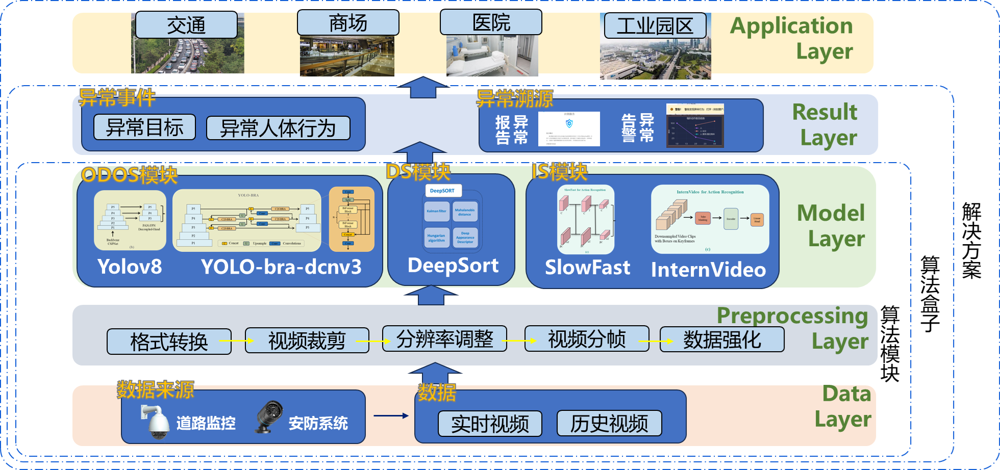
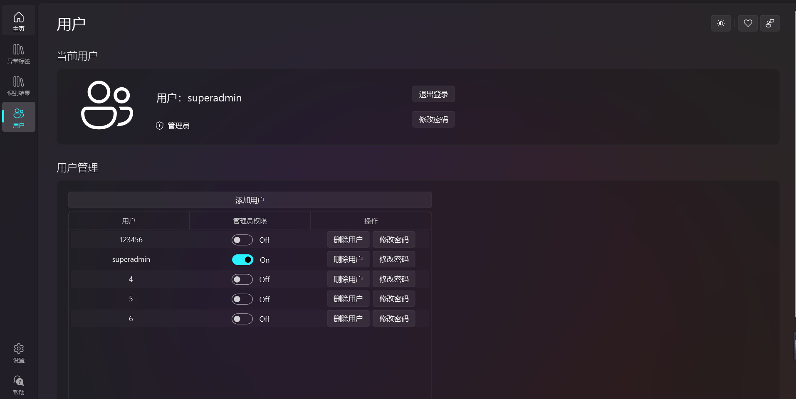
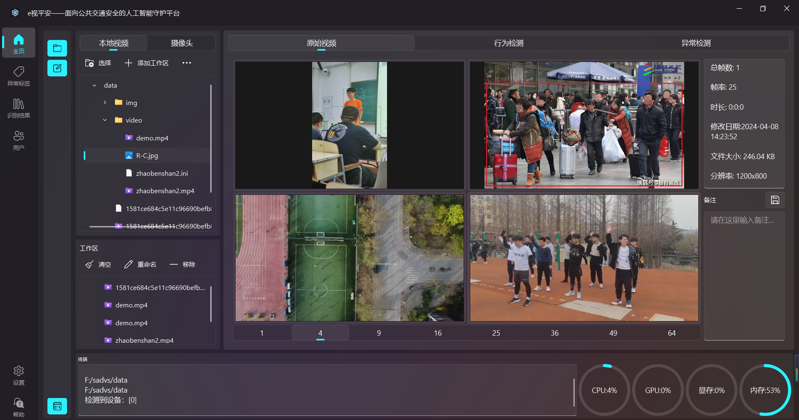
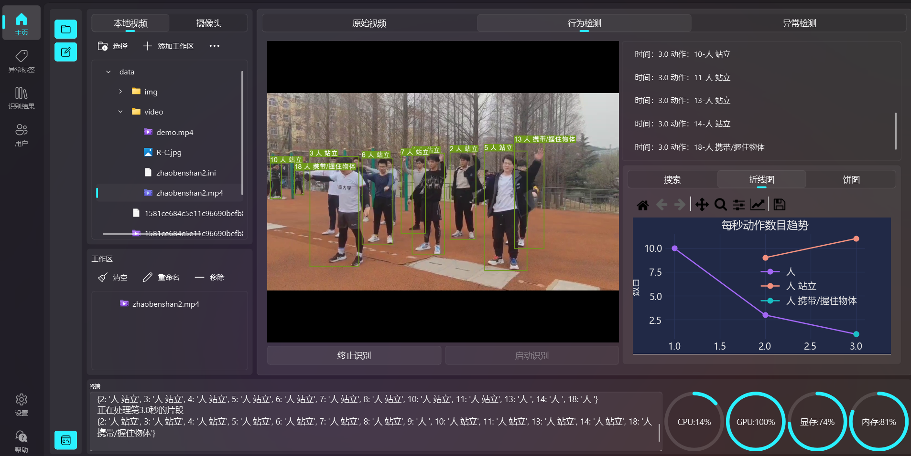
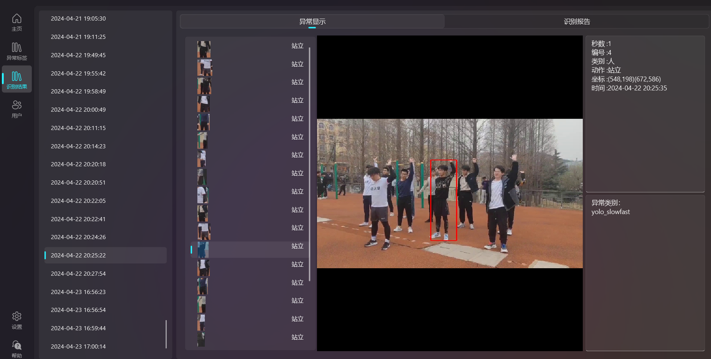
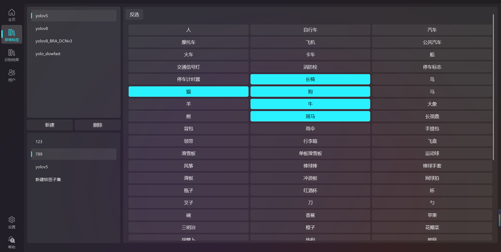
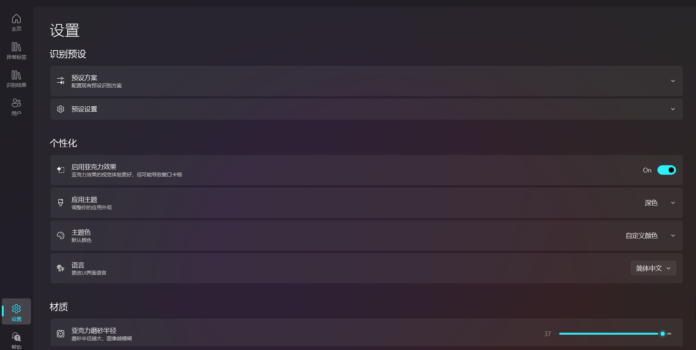

# e视平安 —— 面向公共交通安全的人工智能守护平台

[](https://www.python.org/)
[](https://pypi.org/project/PyQt5/)
[](https://pytorch.org/)
[](LICENSE)

<p align="center">
  
</p>

## 📋 项目简介

**e视平安**是一款基于深度学习的智能视频分析系统，专为公共交通安全监控场景设计。系统融合多目标检测与时空动作识别技术，实现对视频流中异常行为的实时检测、追踪与预警，为城市公共安全提供智能化技术保障。

### 核心能力

| 功能模块 | 技术实现 | 应用场景 |
|---------|---------|---------|
| 🎯 多目标检测 | YOLOv5 / YOLOv8 / YOLOv8-BRA-DCNv3 | 人、车、物等目标识别 |
| 🏃 行为识别 | YOLO + SlowFast 双分支网络 | 异常动作检测（打架、摔倒等） |
| 🔍 目标追踪 | DeepSORT 算法 | 跨帧目标身份保持 |
| 📊 数据分析 | 实时流量统计与可视化 | 人流/车流密度监测 |
| 📄 智能报告 | 自动化PDF生成 | 异常事件归档与追溯 |

---

## 🏗️ 系统架构


---

## 🚀 快速开始

### 环境要求

- **操作系统**: Windows 10/11, Linux (Ubuntu 18.04+)
- **Python**: 3.8 或更高版本
- **CUDA**: 11.1+ (推荐，用于GPU加速)
- **显存**: 建议 4GB+

### 安装步骤

#### 1. 克隆仓库

```bash
git clone https://github.com/yourusername/e-shi-ping-an.git
cd e-shi-ping-an
```

#### 2. 创建虚拟环境

```bash
# 使用 conda
conda create -n eshi python=3.9
conda activate eshi

# 或使用 venv
python -m venv venv
# Windows: venv\Scripts\activate
# Linux/Mac: source venv/bin/activate
```

#### 3. 安装依赖

```bash
pip install -r requirements.txt
```

**核心依赖清单:**

| 包名 | 版本 | 用途 |
|-----|------|------|
| PyQt5 | >=5.15.0 | GUI框架 |
| PyTorch | >=1.9.0 | 深度学习框架 |
| torchvision | >=0.10.0 | 视觉模型库 |
| opencv-python | >=4.5.0 | 视频处理 |
| pytorchvideo | >=0.1.5 | SlowFast模型 |
| matplotlib | >=3.4.0 | 数据可视化 |
| reportlab | >=3.6.0 | PDF生成 |
| PyMuPDF | >=1.19.0 | PDF阅读 |
| qfluentwidgets | >=0.5.0 | 现代化UI组件 |

#### 4. 下载预训练模型

```bash
# 创建模型目录
mkdir -p weights

# 下载YOLOv5权重
wget https://github.com/ultralytics/yolov5/releases/download/v6.2/yolov5s.pt -O weights/yolov5s.pt
```

#### 5. 运行应用

```bash
# 启动主程序
python TransDetecter.py
```

---

## 📖 使用指南

### 用户认证

系统支持多用户管理与权限控制：

- **超级管理员**: 系统配置、用户管理、所有功能访问
- **管理员**: 模型配置、标签管理、识别任务管理
- **普通用户**: 视频预览、识别结果查看（受限）

<p align="center">
  
</p>

### 主要功能模块

#### 1. 原始视频 (Original Video)

- 本地视频文件浏览与播放
- 摄像头实时预览（支持多路）
- 视频剪辑与预处理
- 多画面分屏显示（1/4/9/16/25/36/49/64画面）

<p align="center">
  
</p>

#### 2. 行为检测 (Action Detection)

核心识别界面，支持以下模型：

| 模型 | 特点 | 适用场景 |
|-----|------|---------|
| **YOLOv5** | 速度快，精度高 | 常规目标检测 |
| **YOLOv8-BRA-DCNv3** | 密集人群优化 | 拥挤场景检测 |
| **YOLO+SlowFast** | 时空动作识别 | 异常行为检测 |
| **YOLOv8** | 实验性功能 | 头部与全身检测 |

**操作流程:**
1. 选择视频源（本地文件/摄像头）
2. 添加至工作区
3. 配置识别参数（模型、标签集、置信度等）
4. 启动识别
5. 实时查看检测结果与统计图表

<p align="center">
  
</p>

#### 3. 异常检测 (Anomaly Detection)

- 异常事件列表展示
- 异常截图与详细信息查看
- 自动生成识别报告（PDF）
- 历史记录查询与过滤

<p align="center">
  
</p>

#### 4. 标签设置 (Label Settings)

- 多模型标签集管理
- 自定义标签子集创建
- 标签映射字典配置

<p align="center">
  
</p>

#### 5. 系统设置 (Settings)

- 识别预设方案管理
- 主题与个性化配置
- 性能参数调优

<p align="center">
  
</p>

---

## ⚙️ 配置说明

### 配置文件结构

```
.
├── config.json              # 识别预设配置
├── Default settings.txt     # 默认路径配置
├── usersdb                  # 用户数据库（加密）
├── saved                    # 记住密码缓存
├── labels/                  # 标签集目录
│   ├── yolov5/
│   │   ├── yolov5.pbtxt
│   │   ├── yolov5_re.pbtxt
│   │   └── 字典.txt
│   ├── yolo_slowfast/
│   │   ├── ava_action_list.pbtxt
│   │   └── 字典.txt
│   └── yolov8_BRA_DCNv3/
├── exception/               # 异常检测结果存储
├── result/                  # 识别结果输出
└── cache/                   # 模型缓存
```

### 标签集格式 (PBTXT)

```protobuf
# labels/yolo_slowfast/ava_action_list.pbtxt
item {
  name: "站立"
  id: 1
}
item {
  name: "行走"
  id: 2
}
# ...
```

### 字典映射文件

```json
// labels/yolov5/字典.txt
{
  "person": "人",
  "bicycle": "自行车",
  "car": "汽车",
  "motorcycle": "摩托车",
  "bus": "公共汽车",
  "truck": "卡车"
}
```

---

## 🔧 高级配置

### GPU加速配置

```python
# 在代码中指定GPU设备
# detect.py 或 detect_yolov5.py 中修改
device = '0'  # 使用第一块GPU
device = '0,1,2,3'  # 使用多GPU
device = 'cpu'  # 仅使用CPU
```

### 模型参数调优

| 参数 | 说明 | 默认值 | 建议范围 |
|-----|------|--------|---------|
| `conf_thres` | 置信度阈值 | 0.4 | 0.25-0.6 |
| `iou_thres` | NMS IoU阈值 | 0.4 | 0.3-0.6 |
| `max_det` | 最大检测数 | 100 | 50-1000 |
| `line_thickness` | 检测框线宽 | 2-3 | 1-5 |
| `imgsz` | 输入图像尺寸 | 640 | 320-1280 |

---

## 📊 性能指标

在 NVIDIA RTX 3060 上的测试性能：

| 模型 | 输入分辨率 | FPS | 显存占用 |
|-----|-----------|-----|---------|
| YOLOv5s | 640×640 | ~45 | ~2.5GB |
| YOLOv5m | 640×640 | ~30 | ~4.0GB |
| YOLO+SlowFast | 640×640 | ~15 | ~6.5GB |
| YOLOv8-BRA-DCNv3 | 640×640 | ~25 | ~5.0GB |

---

## 🛠️ 开发指南

### 项目结构

```
SADVS/
├── UI/                      # UI界面文件
│   ├── centralwidget.py     # 主界面布局
│   ├── VdWidget.py         # 视频显示组件
│   └── ...
├── models/                  # 深度学习模型
│   ├── common.py           # YOLO通用模块
│   └── ...
├── utils/                   # 工具函数
│   ├── dataloaders.py      # 数据加载
│   ├── general.py          # 通用工具
│   └── myutil.py           # 全局配置
├── deep_sort/              # DeepSORT追踪
├── detect.py               # YOLO+SlowFast检测主程序
├── detect_yolov5.py        # YOLOv5检测
├── detect_yolov8.py        # YOLOv8检测
├── mainwindow.py           # 主窗口逻辑
├── MainUI.py               # 应用入口
├── TransDetecter.py        # 程序启动器
├── Users.py                # 用户管理
├── PDF.py                  # 报告生成
├── Video.py                # 视频播放核心
├── range_slider.py         # 范围滑块组件
├── setting_interface.py    # 设置界面
├── view_interface.py       # 用户管理界面
├── labels_settings.py      # 标签设置
└── model_settings.py       # 模型设置
```

### 添加新检测模型

1. 创建 `detect_yourmodel.py`，实现 `run()` 函数
2. 在 `mainwindow.py` 的 `IdentifyThreads.start_identify()` 中添加模型调用
3. 在 `setting_interface.py` 中添加模型选项

```python
# 示例接口
@smart_inference_mode()
def run(
    pdf,                    # PDF生成器
    weights='model.pt',     # 模型权重
    source='data/images',   # 输入源
    imgsz=(640, 640),       # 输入尺寸
    conf_thres=0.25,        # 置信度阈值
    iou_thres=0.45,         # IoU阈值
    device='',              # 计算设备
    show_window=None,       # 显示窗口
    select_labels=None,     # 选择标签
    **kwargs
):
    # 实现检测逻辑
    pass
```

---

## 🤝 贡献指南

我们欢迎社区贡献！请遵循以下流程：

1. **Fork** 本仓库
2. 创建 **Feature Branch** (`git checkout -b feature/AmazingFeature`)
3. **Commit** 更改 (`git commit -m 'Add some AmazingFeature'`)
4. **Push** 到分支 (`git push origin feature/AmazingFeature`)
5. 创建 **Pull Request**

### 代码规范

- 遵循 [PEP 8](https://www.python.org/dev/peps/pep-0008/) 编码规范
- 使用类型注解提高代码可读性
- 关键函数添加文档字符串（Docstring）

---

## 📄 许可证

本项目采用 [MIT License](LICENSE) 开源许可证。

```
MIT License

Copyright (c) 2024 e视平安团队

Permission is hereby granted, free of charge, to any person obtaining a copy
of this software and associated documentation files (the "Software"), to deal
in the Software without restriction, including without limitation the rights
to use, copy, modify, merge, publish, distribute, sublicense, and/or sell
copies of the Software, and to permit persons to whom the Software is
furnished to do so, subject to the following conditions:

The above copyright notice and this permission notice shall be included in all
copies or substantial portions of the Software.

THE SOFTWARE IS PROVIDED "AS IS", WITHOUT WARRANTY OF ANY KIND, EXPRESS OR
IMPLIED, INCLUDING BUT NOT LIMITED TO THE WARRANTIES OF MERCHANTABILITY,
FITNESS FOR A PARTICULAR PURPOSE AND NONINFRINGEMENT. IN NO EVENT SHALL THE
AUTHORS OR COPYRIGHT HOLDERS BE LIABLE FOR ANY CLAIM, DAMAGES OR OTHER
LIABILITY, WHETHER IN AN ACTION OF CONTRACT, TORT OR OTHERWISE, ARISING FROM,
OUT OF OR IN CONNECTION WITH THE SOFTWARE OR THE USE OR OTHER DEALINGS IN THE
SOFTWARE.
```

---

## 🙏 致谢

本项目基于以下优秀开源项目构建：

- [YOLOv5](https://github.com/ultralytics/yolov5) by Ultralytics
- [YOLOv8](https://github.com/ultralytics/ultralytics) by Ultralytics
- [SlowFast](https://github.com/facebookresearch/SlowFast) by Meta AI
- [PyTorchVideo](https://github.com/facebookresearch/pytorchvideo) by Meta AI
- [DeepSORT](https://github.com/nwojke/deep_sort) by Nicolai Wojke
- [QFluentWidgets](https://github.com/zhiyiYo/PyQt-Fluent-Widgets) by zhiyiYo
- [PyQt5](https://www.riverbankcomputing.com/software/pyqt/) by Riverbank Computing

---


<p align="center">
  <b>用AI守护公共安全，让城市更智能、更安全</b>
</p>

<p align="center">
  Made with ❤️ by e视平安团队

</p>
