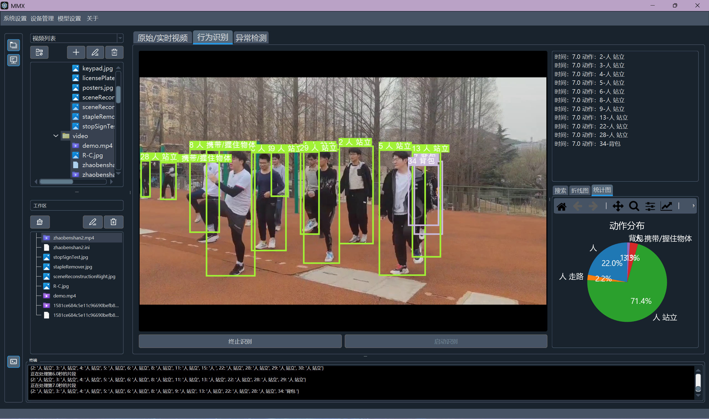

使用 YOLO v5 + SlowFast 结合的技术架构进行人体动作识别。
利用PyQt构建整个应用界面逻辑。

### 使用方法

首先运行
```bash
pip install -r requirements.txt
```
安装所需的库，另外``Pytorch``库需要根据环境不同自行安装。
然后运行
```bash
python mainwindow.py 
```
即可编译

### 运行截图

